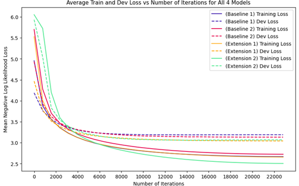

# Neural Recipe Generator

- [Introduction](#introduction)
- [Analysis](#analysis)
- [Quantitative Results](#quantitative-evaluation)
- [Qualitative Results](#qualitative-evaluation)
- [References](#references)

## Introduction

Using Language Models (LMs) to generate recipes given a list of ingredients. Various state-of-the-art methods have been applied to increase quality of generated recipes, enforce the inclusion of given ingredients, eliminate hallucinations, and reduce repetition, such as attention, and NeuroLogic Decoding [1]. Following Kiddon et al., the dataset used for this project is the Now You're Cooking! recipe library which is a data set containing over 150,000 recipes [2].

I investigate four different models:
- Baseline 1: Encoder-Decoder LSTM model
- Baseline 2: Encoder-Decoder model with attention
- Extension 1: Encoder-Decoder model with attention + pre-trained GLoVE embeddings
- Extension 2: Encoder-Decoder model with attention + multi-layer encoder-decoder + NeuroLogic Decoding

### NeuroLogic Decoding [1]
NeuroLogic Decoding is a modified beam search which is executed at test time to enable language models to satisfy a set of positive and negative constraints. In this case, for a particular sample, the set of positive constraints consist of the set of input ingredients while the set of negative constrains consist of the set of all other ingredients. At each time step, the decoder has $k$ hypotheses in the current beam and for each hypothesis, the decoder predicts a distribution over the vocabulary $V$ resulting in $|V|\times K$ total candidates from which the best candidates must be chosen to continue the hypothesis until the maximum recipe length has been reached or it has generated. Choosing the best candidates involves several steps. Here I have implemented a modified version of the Pruning and Selection step.

In the Pruning step, the score of each candidate starts off with their likelihood as predicted by the decoder. We then identify candidates which results in an irreversible unsatisfaction state which is achieved by satisfying a negative constraint (i.e. including an extra ingredient) and give them a large penalty, this discourages the generation of extra ingredients. Furthermore, candidates which are not in the top-$\alpha$ in terms of likelihood suffer a small penalty, and finally candidates for which their inclusion would result in a low number of satisfied clauses are also given a penalty. Note that the paper suggests to "discard" instead of penalizing however, I find that in some edge cases, this might result in dropping all candidates and resulting in an error, therefore I opt for a soft filtration via penalties. Next, in the Selection Step, the score of each candidate is updated as follows:

$$
\begin{align}
  s = s + \lambda \cdot \underset{D(a_i, y)\in \text{state S1}}{max} \frac{|\hat{a}_i|}{|a_i|}
\end{align}
$$

wherein $\hat{a}_i$ is the matched prefix of a positive constraint $a_i$, $D(a_i, y)$ is a boolean function indicating the occurrence of key phrase $a_i$ in a sequence $y$, S1 represents a reversible unsatisfaction (unsatisfied clause which could be satisfied in the future), and $\lambda$ is a hyper-parameter. In essence, this not only rewards candidates which fully satisfies a positive constraint but also rewards those that partially satisfy a positive constraint. For instance, if one of the input ingredients is "all purpose flour", the positive constraint would be "all" $\land$ "purpose" $\land$ "flour", and thus the candidate "all" would receive a reward of $\frac{1}{3}$. Finally, the top-$k$ candidates with the highest scores are chosen to continue to the next time step. In this way, the model is incentivized to include all input ingredients in the generated recipe and to avoid generating extra ingredients.

## Analysis

Training loss for Baseline 1 starts out the lowest and decreases the fastest compared to other models but despite this, it ends up with the second highest training loss. The dev loss shows a similar trend; starting with the lowest value however quickly plateauing and ends up with the highest dev loss. Its speedy convergence can be attributed to being the simplest model with the least number of parameters to train. However, this also means that it is the weakest model and since it is the only model without attention, it faces the bottleneck problem where the entire ingredients sequence must be captured in the final hidden state which loses a lot of context, resulting in the weakest generalization performance. The model clearly overfits ~4000-6000 iterations as the train loss keeps decreasing while the dev loss remains static.

Baseline 2’s training loss starts high but declines quickly, though it eventually plateaus with the highest training loss among all models. Conversely, while the dev loss starts out larger than Baseline 1’s, it quickly improves and ultimately achieves a lower dev loss. Its improved generalization performance over Baseline 1 can be attributed to the attention mechanism which enables the decoder to access all encoder hidden states directly instead of relying solely on the final encoder hidden state, alleviating the bottleneck problem. The higher training loss may be caused by the difficulty of learning attention scores for long sequences as, during training, I masked out attention scores for input padding and thus the gradients for parameters computing attention scores for some of the last positions in the input sequence are rarely propagated. Due to this, it exhibits less overfitting compared to Baseline 1.

Extension 1 is built on top of Baseline 2 and as expected, its training loss starts similarly high but declines more rapidly, quickly surpassing Baseline 2 to achieve lower training loss by the end. It also achieves much lower dev loss than Baseline 2 and is, in fact, the lowest among all models, demonstrating the best generalization to unseen data. This is due to the pre-trained GLoVE embeddings, trained on a much larger corpus which captures semantic meanings and relationships between words. Furthermore, while I froze the pre-trained embeddings, I allow the model to learn embeddings for out-of-vocabulary words, thus retaining the meaningful embeddings while learning from the dataset for more niche terms. This means that from the start, the model is provided with useful semantics rather than random noise, allowing it to converge faster. Its low degree of overfitting is due to frozen pre-trained embeddings.

Extension 2, built on top of Baseline 2, starts with the highest training loss among all models but gradually declines to achieve the lowest training loss overall. Similarly, its dev loss starts out very large and slowly decreases until it is on par with Extension 1, demonstrating strong generalization performance. Its slow convergence is due to having ~3x more parameters compared to Baseline 2 as each of the 3 layers in the encoder and decoder have their own set of parameters. This increased parameter count enhances its representational capacity, leading to improved performance but also results in the worst overfitting as the more parameters the model has, the more complex it is and thus, the more it can overfit to the training set.

## Quantitative Evaluation
| Model       | BLEU-4(%) | METEOR(%) | Avg. % given items | Avg. extra items |
|-------------|-----------|-----------|--------------------|------------------|
| Baseline 1  | 4.45      | 20.2      | 25.56              | 2.98             |
| Baseline 2  | 4.95      | 20.9      | 33.45              | 2.30             |
| Extension 1 | 5.52      | 21.0      | 31.07              | 2.10             |
| Extension 2 | **5.81**     | **23.3**      | **79.46**              | **0.27**             |

BLEU-4 measures the proportion of 4-gram matches between generated and reference texts. METEOR computes a harmonic mean of unigram precision and recall, considering synonyms, stemming, and paraphrasing. Avg. % given items indicates the percentage of input ingredients included in the generation, and avg. extra items is the mean number of extraneous ingredients.

All models achieve low BLEU-4 and METEOR scores, indicating that they struggle in replicating ground-truth recipes which is unsurprising given the diverse styles in which recipes can be written (in bullet point form, descriptive, anecdotal, etc.). Compared to Kiddon et al.’s 3.8% and 11.5% BLEU-4 and METEOR scores, our results are quite good in comparison.

Baseline 1 exhibits the lowest BLEU-4 and METEOR scores as it is the weakest model with the fewest parameters and since it lacks attention, it faces the bottleneck problem discussed in 2.4. It tends to include common ingredients such as “salt” due to their high likelihood in most recipes, resulting in high avg. extra items, while neglecting rarer ones which have low likelihood as they are not often encountered in the training set, resulting in low avg. % given items. 

With the addition of attention, Baseline 2 sees a slight improvement in BLEU-4 and METEOR scores as it no longer faces the bottleneck problem, with a notable increase of 7.89% in avg. % of given items. This is because the decoder can now pay attention to specific parts of the input, particularly, ingredients, while putting less weightage on irrelevant words such as numbers or punctuation. 

Extension 1 surpasses Baseline 2 in BLEU-4 and METEOR scores, benefiting from the addition of meaningful word embeddings that enhance comprehension of unseen data, allowing it to generate recipes which are more semantically linked with the input ingredients. On average, it generates fewer extra items compared to Baseline 2 but surprisingly has slightly lower avg. % given items. Perhaps this is caused by words which have various meanings, for example “oil” is not exclusively a cooking ingredient, it can also refer to motor oil, or the act of covering something with oil, and since the embeddings are not finetuned for recipe generation, it likely encodes all these different semantic meanings for “oil” and may not recognize such words as purely being an ingredient. 

Extension 2 demonstrates the best performance across all metrics, achieving a staggering 46% increase in avg. % of given items compared to Baseline 2 and 2.03 fewer extra ingredients on average. This is because NeuroLogic Decoding incentivizes selecting candidates that satisfy positive constraints (input ingredients) by boosting their scores and penalizing words which result in irreversible unsatisfaction (including an ingredient not in the input list). As a side effect, this also boosts BLEU-4 and METEOR scores as more ingredients in the ground-truth appear within the generated recipe.

## Qualitative Evaluation

**Please see [this file](generated_31989101.csv) for 700+ qualitative examples.**

Here I analyze the result of all four models given the ingredients below:

**Ingredients:** 2 c sugar, 1/4 c lemon juice, 1 c water, 1/3 c orange juice, 8 c strawberries

| Baseline 1                                                                                                                                                                                                                                                                                                                                                           | Baseline 2                                                                                                                                                                                                                                                                | Extension 1                                                                                                                                                                                                                               | Extension 2                                                                                                                                                                                                                                                                                        |
|----------------------------------------------------------------------------------------------------------------------------------------------------------------------------------------------------------------------------------------------------------------------------------------------------------------------------------------------------------------------|---------------------------------------------------------------------------------------------------------------------------------------------------------------------------------------------------------------------------------------------------------------------------|-------------------------------------------------------------------------------------------------------------------------------------------------------------------------------------------------------------------------------------------|----------------------------------------------------------------------------------------------------------------------------------------------------------------------------------------------------------------------------------------------------------------------------------------------------|
| RECIPE_START combine sugar , cornstarch and water in a saucepan bring to a boil , stirring constantly boil for 1 minute remove from heat and stir in lemon juice and lemon juice pour into a large bowl and stir in the orange juice and lemon juice pour into a large bowl and stir in the orange juice and lemon juice pour into a large bowl and chill RECIPE_END | RECIPE_START combine sugar , water , lemon juice and salt in a saucepan bring to a boil , stirring constantly boil for 5 minutes , stirring constantly remove from heat and stir in lemon juice and pour into a sterilized jars seal and store in refrigerator RECIPE_END | RECIPE_START combine sugar , water , and lemon juice in a saucepan bring to a boil over medium heat , stirring constantly , until sugar dissolves remove from heat and cool to room temperature add vanilla and mix well chill RECIPE_END | RECIPE_START combine sugar and water in a saucepan and bring to a boil add orange juice , lemon juice , and sugar bring to a boil and boil for 5 minutes remove from heat and let cool slightly add strawberries and sugar and stir until dissolved pour into glasses , cover and chill RECIPE_END |

Baseline 1’s recipe contains a lot of repetition towards the end which reflects its poor BLEU-4 and METEOR scores. This is a common problem for multi-sentence generation, due to the greedy decoding, it keeps repeating sequences which are of higher probability compared to the end token. Baseline 2’s recipe is noticeably better than Baseline 1 as it has very little repetition since the attention mechanism allows it to pay attention to different ingredients at each timestep rather than just the final summarized encoder hidden state. Extension 1 has the most coherent generation, with no repetition and reads like a valid recipe which matches the higher BLEU-4 and METEOR scores observed in 2.5. Meanwhile, Extension 2 repeats “boil” several times, perhaps due to NeuroLogic Decoding’s penalty for low likelihood candidates, discouraging other avenues of exploration, and since it is not an ingredient, it is unaffected by the constraints, which may lead the model to be shortsighted and greedy.

The recipes generated by Baseline 1, 2, and Extension 1 each contain an extra ingredient (cornstarch, salt, and vanilla respectively) as these are common ingredients which have high likelihood for most inputs. All three also completely omit “strawberries” from the recipe as it may be a rarer ingredient and thus have lower likelihood. These reflect the low avg. % given items and the relatively high avg. extra items seen in 2.5. Meanwhile, Extension 2 includes all ingredients, even “strawberry”, and does not generate extra ingredients as NeuroLogic Decoding boosts the probability of selecting input ingredients and reduces the probability of selecting extra ingredients. This reflects its high avg. % given items and low avg. extra items in 2.5.

### References:

[1] X. Lu, P. West, R. Zellers, R. Le Bras, C. Bhagavatula, and Y. Choi, 'NeuroLogic Decoding: (Un)supervised Neural Text Generation with Predicate Logic Constraints', in *Proceedings of the 2021 Conference of the North American Chapter of the Association for Computational Linguistics: Human Language Technologies*, 2021, pp. 4288–4299.

[2] C. Kiddon, L. Zettlemoyer, and Y. Choi, 'Globally Coherent Text Generation with Neural Checklist Models', in _Proceedings of the 2016 Conference on Empirical Methods in Natural Language Processing_, 2016, pp. 329–339.
